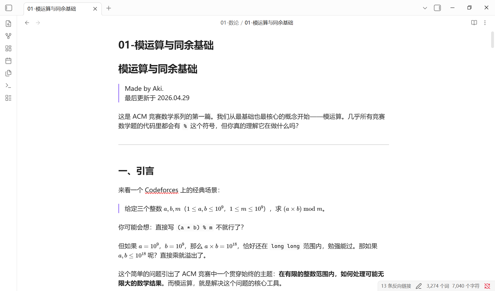

# ACM 竞赛数学系列

面向 **CQUE-ACMers 集训队**的全数学板块系统学习材料。覆盖数论、组合数学、博弈论、概率与期望、线性代数、计算几何六大板块，共 **103 篇**，竞赛导向，重推导轻模板。

> **阅读建议：** 本系列含大量 LaTeX 数学公式，建议使用 [Obsidian](https://obsidian.md)、Typora 或 VSCode（配合 Markdown+Math 插件）阅读以获得最佳渲染效果。

## 目录

| 板块 | 篇数 | 难度分布 |
|------|:----:|------|
| [01-数论](01-数论/) | 28 | 🟢 8 · 🟡 10 · 🔴 8 · 🟣 2 |
| [02-组合数学](02-组合数学/) | 23 | 🟢 6 · 🟡 8 · 🔴 7 · 🟣 2 |
| [03-博弈论](03-博弈论/) | 12 | 🟢 4 · 🟡 5 · 🔴 3 |
| [04-概率与期望](04-概率与期望/) | 10 | 🟢 3 · 🟡 4 · 🔴 3 |
| [05-线性代数](05-线性代数/) | 10 | 🟢 3 · 🟡 4 · 🔴 3 |
| [06-计算几何](06-计算几何/) | 16 | 🟢 5 · 🟡 6 · 🔴 5 |
| [07-附录](07-附录/) | 4 | 预热 · 策略 · 题单 · 模板 |

📖 完整索引与跳转请参见 [INDEX.md](INDEX.md)。

## 难度标识

- 🟢 **入门**：零基础可读
- 🟡 **进阶**：需要该板块基础篇知识
- 🔴 **高阶**：需要较完整基础
- 🟣 **专题/综合**：串联多个知识点

## 系列特色

- **竞赛导向**：每篇以「为什么学这个」开篇，以「什么时候用」收尾
- **重推导轻模板**：思路 > 推导 > 代码；代码是推导的自然产物而非终点
- **新人友好**：引导式语言，手算例子穿插，❓ 标注答疑与易错点
- **做题友好**：推荐题目均带链接

## 推荐阅读路径

按板块顺序推进：**数论 → 组合数学 → 博弈论 → 概率与期望 → 线性代数 → 计算几何**

每个板块内部按序号递增阅读，后续篇章依赖前置知识。附录可随时查阅。

## 参考代码

各篇文档的例题与练习题参考代码整理在 [codes/](codes/) 目录下，提供 **C++17** 和 **Python 3** 双语实现。命名规则等详见目录内 README。

### 已完成

| 板块 | 篇目 | Python 3 | C++17 |
|------|------|:--------:|:-----:|
| 数论 | #1 模运算与同余基础 | ✅ | ⏳ |
| 数论 | #2 GCD 与 LCM | ✅ | ⏳ |
| 数论 | #3 裴蜀定理与扩展欧几里得 | ✅ | ⏳ |
| 其余 | 全部 6 大板块 100 篇 | ⏳ | ⏳ |

> ⏳ = 待更新，欢迎贡献

## 致谢

本系列由 **CQUE-ACMers 集训队**发起与维护。

内容创作过程中得到了以下 AI 的深度协助：

- **[DeepSeek](https://github.com/deepseek-ai)** — 提供数学推导验证、例题生成与内容润色
- **[Claude (Anthropic)](https://www.anthropic.com)** — 提供结构设计、审校与多轮迭代优化

本仓库由 AI 辅助完成 Git 管理与自动化维护。

## 参与贡献

欢迎 CQUE-ACMers 及其他同学共同完善本系列：

- **发现笔误、推导错误或死链？** 提交 [Issue](https://github.com/AlanAkillove/ACM/issues) 反馈
- **有更好的例题或证明思路？** 欢迎提 Pull Request
- **对内容编排有建议？** 可以在 Issue 中讨论，或直接在 Discussions 中交流

每一份反馈都能让这份材料变得更好。

## 最近更新

### 2026.05.18 — 新增整除分块应用例题与复杂度更新

- [#6 算术基本定理与质因数分解](01-数论/06-算术基本定理与质因数分解.md) 新增 **3.5 应用：1 到 n 的约数个数之和与整除分块** 小节，包含公式推导 ($\sum\tau(i)=\sum\lfloor n/d\rfloor$) 与 $O(\sqrt{n})$ 实现
- 新增 NowCoder [约数个数的和](https://ac.nowcoder.com/acm/problem/14682) 练习题
- 更新复杂度表，新增整除分块行

### 2026.05.16 — 新增"生成所有约数"内容与练习题

- [#6 算术基本定理与质因数分解](01-数论/06-算术基本定理与质因数分解.md) 新增 **3.4 生成所有约数** 小节，包含旧因子 × 幂次构造法的 C++ / Python 实现与手算演示
- 新增 NowCoder [小红的因子幂和](https://ac.nowcoder.com/acm/contest/134529/C) 练习题，串联质因数分解、枚举因子与快速幂
- 同步更新[全板块题单总汇](07-附录/102-全板块题单总汇.md)
- 修复 [#4 素数（上）](01-数论/04-素数（上）：判定与试除法.md) Miller-Rabin `isPrime` 对 2, 3 的特判与底数过滤逻辑

### 2026.05.11 — 练习题全面校验与修复

对所有 6 大板块（数论、组合数学、博弈论、概率与期望、线性代数、计算几何）近 90 篇文档中的推荐练习题进行了逐题校验，确保每道题与对应文档主题匹配。总计：

- 替换不匹配题目 13+ 道（如概率论中的几何题→概率题、博弈论中的数论题→博弈题等）
- 删除重复条目 15+ 处（同一题目在同一文件或相邻文档中重复列出）
- 同步更新[全板块题单总汇](07-附录/102-全板块题单总汇.md)

## 开源许可

本项目完全开源，所有内容可自由使用、复制、修改、分发，用于学习、教学、竞赛培训等任何用途。无需额外授权。

---

> Made with ❤️ by CQUE-ACMers · 最后更新于 2026.05.18
